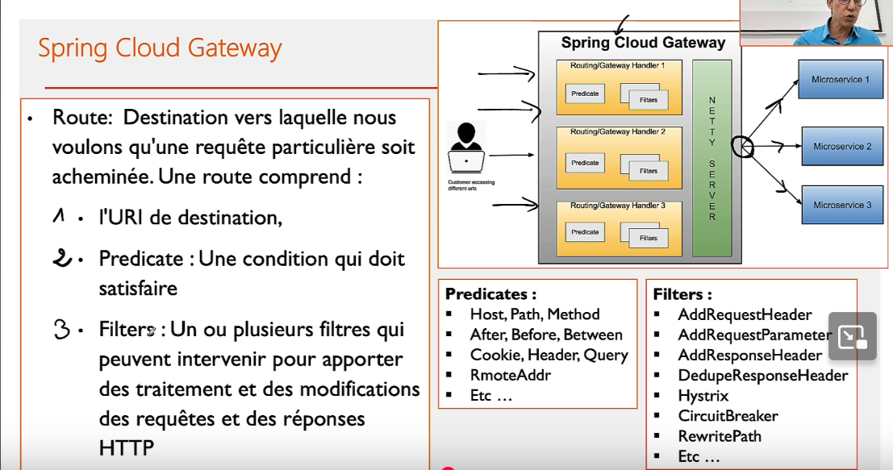

# Managing micro services

## Spring Cloud Gateway



Le rôle de la gateway est de diriger une requête vers le bon microservice.
La route de la requête est caratérisé par :

1. l'URI
2. Le prédicat (une condition à laquelle doit répondre la requête)
3. Les filtres (module le contenu de la requête)

Dans le fichier de configuration `application.yml` :

```yaml
spring:
  cloud:
    gateway:
      routes:
        - id: r1
          uri: http://localhost:9001
          predicates:
            - Path=/produits/**
          filters:
            - ...
```


| Fonction                         | Description                                                                 |
|----------------------------------|-----------------------------------------------------------------------------|
| **Routage dynamique**            | Redirige les requêtes selon le chemin, les headers, les paramètres         |
| **Authentification centralisée** | Vérifie les JWT ou tokens OAuth2 avant de transmettre la requête           |
| **Rate limiting**                | Limite le nombre de requêtes par IP ou utilisateur                         |
| **Circuit breaker**              | Coupe les appels vers un service défaillant (via Resilience4j ou Hystrix) |
| **Transformation des requêtes**  | Modifie les headers, le corps ou les paramètres avant routage              |
| **Logging & monitoring**         | Centralise les logs et les métriques des appels                            |

## Discovery Service


Dans l'exemple au dessus, les données sont entrées en dur, mais en réalité, la configuration est dynamique.
Et pour cela on doit utiliser `Discovery Service`.

Utiliser `@EnableEurekaServer` dans le fichier main.

`Spring eureka` propose une interface sur l'url `http://localhost:8761/`.

Pour qu'eurka utilise l'adresse ip et non l'adresse local de la machine :

```yaml
eureka.instance.prefere-ip-address=true
```

Grace à Discovery service, on peut délester la gateway de faire le routing.
Pour cela, on créé un `@Bean` dans Gateway, qui permet de gérer dynamiquement la config :

```java
@Bean
DiscoveryClientRouteDefinitionLocator locator(ReactiveDiscoveryClient rdc, DiscoveryLocatorProperties dlp) {
    return new DiscoveryClientRouteDefinitionLocator(rdc, dlp);
}
```

A partir d'ici, il sera seulement nécessaire de donner au backend le nom du micro service dans l'URL.

`http://192.168.1.12:8080/PRODUCT-SERVICE/produits`

- On contacte la gateway : `192.168.1.12:8080`
- On demande le micro service : PRODUCT-SERVICE / COMMANDE-SERVICE / PAIEMENT-SERVICE

## Communication inter microservices & Open Feign

Dans le contexte multi micro services, les applications ont besoin de consommer les Api Rest pour fonctionner (ex: le service commandes a besoin du service produits).

On a besoin des `client Rest` comme `RestTemplate`, `WebClient` qui sont des modeles programmatiques, mais aussi `Open Feign` qui est un modèle déclaratif.

Ces communications ne passent pas par la gateway.