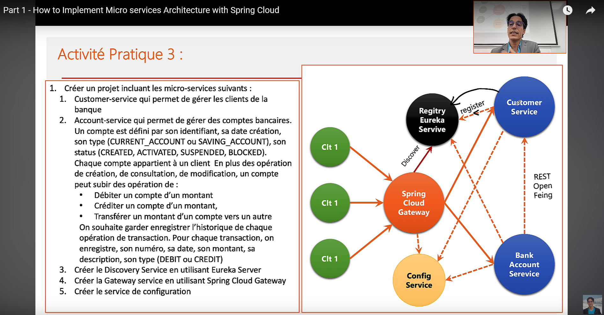
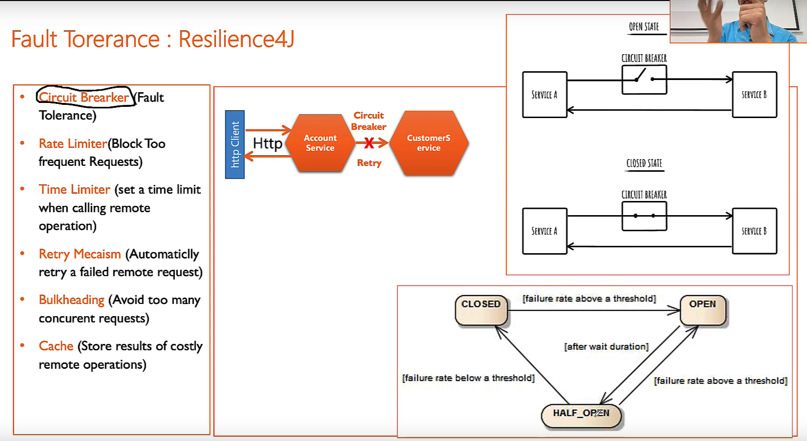
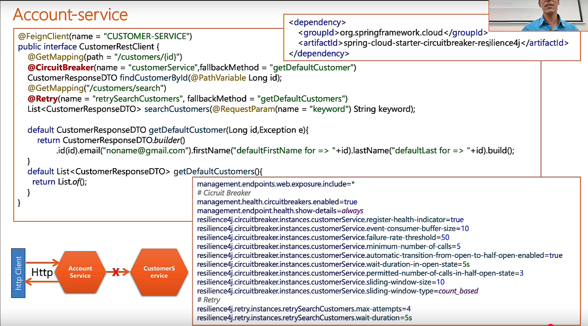

# Architecture micro services grâce à Spring Cloud

L'idée de ce dépot est la gestion d'une application microservices via l'ensemble d'outils et solution qu'offrent Spring.
- 3 microservices (produit, commande, paiement)
- Gateway
- Discovery (Eurka server)
- Client Rest (Open Feign)
- Service de config



Ce dépôt se base sur 3 cours vidéos.

##

[Cours en ligne 1](https://www.youtube.com/watch?v=BqNZJwCvnAE)

## Spring Cloud Gateway


Le rôle de la gateway est de diriger une requête vers le bon microservice.
La route de la requête est caratérisé par :

1. l'URI
2. Le prédicat (une condition à laquelle doit répondre la requête)
3. Les filtres (module le contenu de la requête)

Dans le fichier de configuration `application.yml` :

```yaml
spring:
  cloud:
    gateway:
      routes:
        - id: r1
          uri: http://localhost:9001
          predicates:
            - Path=/produits/**
          filters:
            - ...
```


| Fonction                         | Description                                                                 |
|----------------------------------|-----------------------------------------------------------------------------|
| **Routage dynamique**            | Redirige les requêtes selon le chemin, les headers, les paramètres         |
| **Authentification centralisée** | Vérifie les JWT ou tokens OAuth2 avant de transmettre la requête           |
| **Rate limiting**                | Limite le nombre de requêtes par IP ou utilisateur                         |
| **Circuit breaker**              | Coupe les appels vers un service défaillant (via Resilience4j ou Hystrix) |
| **Transformation des requêtes**  | Modifie les headers, le corps ou les paramètres avant routage              |
| **Logging & monitoring**         | Centralise les logs et les métriques des appels                            |


## Discovery Service

Dans l'exemple au dessus, les données sont entrées en dur, mais en réalité, la configuration est dynamique.
Et pour cela on doit utiliser `Discovery Service`.

Utiliser `@EnableEurekaServer` dans le fichier main.

`Spring eureka` propose une interface sur l'url `http://localhost:8761/`.

Pour qu'eurka utilise l'adresse ip et non l'adresse local de la machine :

```yaml
eureka.instance.prefere-ip-address=true
```

Grace à Discovery service, on peut délester la gateway de faire le routing.
Pour cela, on créé un `@Bean` dans Gateway, qui permet de gérer dynamiquement la config :

```java
@Bean
DiscoveryClientRouteDefinitionLocator locator(ReactiveDiscoveryClient rdc, DiscoveryLocatorProperties dlp) {
    return new DiscoveryClientRouteDefinitionLocator(rdc, dlp);
}
```

A partir d'ici, il sera seulement nécessaire de donner au backend le nom du micro service dans l'URL.

`http://192.168.1.12:8080/PRODUCT-SERVICE/produits`

- On contacte la gateway : `192.168.1.12:8080`
- On demande le micro service : PRODUCT-SERVICE / COMMANDE-SERVICE / PAIEMENT-SERVICE


## Communication inter microservices : Client Rest & Open Feign

Dans le contexte multi micro services, les applications ont besoin de consommer les Api Rest pour fonctionner (ex: le service commandes a besoin du service produits).

On a besoin des `client Rest` comme `RestTemplate`, `WebClient` qui sont des modeles programmatiques, mais aussi `Open Feign` qui est un modèle déclaratif.

Ces communications ne passent pas par la gateway.

```java
@FeignClient(name = "PRODUCT-SERVICE") // Feign fourni cette donnée à Discovery pour obtenir le bon micro service
public interface ProductRestClient {
    @GetMapping(value = "/produits/{id}")
    Optional<Product> findProductById(@PathVariable Integer id);
}
```

Et le service depuis injectable.

Sans oublier d'ajouter `@EnableFeignClients` dans le fichier main.

## Gérer les problèmes des communications inter microservices : Resilience4J

Une bibliothèque conçue pour aider à rendre leurs applications plus résilientes face aux défaillances des services distants (ou des composants internes)
(dans le contexte d'architecture microservices, où les appels réseau sont fréquents et sujets à des erreurs)



### ❌ Problèmes sans Resilience4j

Dans une architecture microservices, ne pas utiliser une bibliothèque de résilience comme **Resilience4j** expose l'application à plusieurs risques critiques :

| 🧨 Problème                  | ⚠️ Description                                                                 |
|-----------------------------|------------------------------------------------------------------------------|
| **Défaillances en cascade** | Un service lent ou en panne peut bloquer ses consommateurs, saturer les threads et provoquer l'effondrement du système. |
| **Saturation des ressources** | Sans `Bulkhead`, un service peut monopoliser les ressources (threads, connexions), empêchant les autres de fonctionner. |
| **Attente infinie / timeouts** | Sans `TimeLimiter`, les appels bloqués peuvent ralentir l’ensemble du système. |
| **Réessais non contrôlés**  | Sans `Retry`, les réessais manuels peuvent aggraver la charge sur un service déjà instable. |
| **Sur-sollicitation**       | Sans `RateLimiter`, un service peut être submergé par trop de requêtes simultanées. |
| **Manque de visibilité**    | Sans `CircuitBreaker`, il est difficile de détecter et réagir rapidement aux pannes. |

---

### 🧠 Exemple concret

> Un service `Commande` appelle `Paiement`, qui appelle `Fraude`.  
> Si `Fraude` devient lent ou indisponible :
> - `Paiement` attend indéfiniment → saturation des threads.
> - `Commande` ne reçoit pas de réponse → propagation du blocage.
> - Le système entier devient non réactif, même si le problème est localisé.

---

### ✅ Pourquoi utiliser Resilience4j

Resilience4j agit comme un **pare-feu logiciel** :
- Il **détecte les anomalies**,
- **Coupe les appels dangereux**,
- **Réessaie intelligemment**,
- Et **protège les ressources critiques**.

Sans lui, il faudrait coder manuellement ces comportements, ce qui est **complexe, fragile et peu maintenable**.

Dans notre application, on utilise `CircuitBreaker` dans le microservice Commande.



##

[Cours 2](https://www.youtube.com/watch?v=D0Vzlmczups)

##